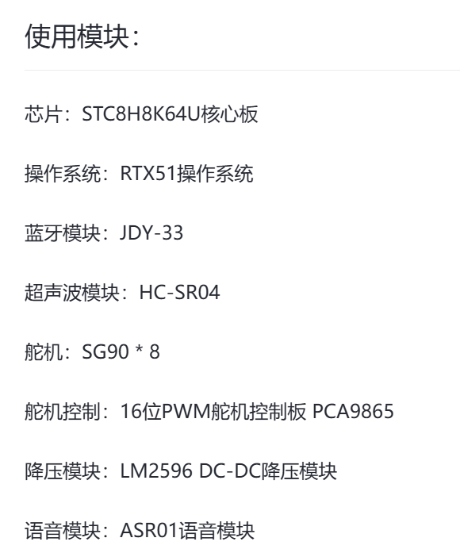

# 硬件资料索引

本目录集中保存四足机器人当前选型相关的用户提供资料，便于硬件、驱动和应用成员在同一位置查阅。资料中的商品页截图、厂商说明和示例代码仅作为选型与联调参考，不能代替对实物丝印、供电、电平、引脚和版本的现场确认。

## 资料目录

| 模块 | 项目当前选型 | 资料 | 使用前必须确认 |
| --- | --- | --- | --- |
| MCU / RTOS | STC8H8K64U / RTX51 Tiny | 项目代码和 [资源登记](../hardware-resources.md) | 24 MHz、下载方式、中断与 Timer 分配 |
| 舵机控制 | PCA9685 16 路 PWM 板 | [PCA9685](pca9685/)：Adafruit 指南、参考 PDF、HW-170 产品说明 JPG、示例 ZIP | 板载地址、电源分区、逻辑电平、I2C 上拉、舵机电源容量和共地 |
| 舵机 | SG90 x 8 | 当前没有独立规格书 | 每路零位、方向、机械极限、脉宽范围和堵转电流 |
| 蓝牙 | JDY-33 | [A4 分页 PDF](bluetooth-jdy33/JDY-33-product-guide.pdf)；[原始长截图](bluetooth-jdy33/JDY-33-product-screenshot.jpg) | **原截图混有 JDY-31、JDY-33、JDY-23 内容**；只可依据实物型号对应的章节配置电压、波特率和 AT 指令 |
| 超声波 | HC-SR04 | 当前没有独立规格书 | Trigger/Echo 电平、计时资源、盲区和安装角度 |
| 降压电源 | LM2596 DC-DC | [A4 分页 PDF](power-lm2596/LM2596-product-guide.pdf)；[原始长截图](power-lm2596/LM2596-product-screenshot.jpg) | 原截图包含多种 LM2596/LM2596S 板型；以实物板型为准，带载测量输出、电流、纹波和温升 |
| 语音识别 | LU-ASR01 / ASR01 | [快速使用说明](voice-lu-asr01/LU-ASR01-quick-start-guide.pdf)；[多控命令和 IO 初始化例程](voice-lu-asr01/LU-ASR01-multi-command-IO-example.hd) | 模块版本、供电、电平、串口/IO 模式和生成工具兼容性 |

文件完整性可通过 [SHA256SUMS.txt](SHA256SUMS.txt) 核对。第三方资料的归属与再分发提示见 [THIRD_PARTY_NOTICE.md](THIRD_PARTY_NOTICE.md)。

## 联调规则

1. 先核对实物丝印和模块版本，再选择对应资料章节；相似外观不代表参数相同。
2. 舵机电源和逻辑电源必须按实物板说明区分，禁止用 MCU 小电流电源直接带八路舵机。
3. 首次上电前用万用表确认降压模块输出，空载调整后再逐步增加负载并检查温升。
4. 串口模块先确认逻辑电平、默认波特率、换行要求和 AT 模式，再接入主工程。
5. 确认后的引脚、UART、Timer、PWM、ADC 和电源参数应同步写入 [硬件资源登记](../hardware-resources.md)。

## PDF 生成说明

- `LM2596-product-guide.pdf`：由 965 x 10610 的商品资料长截图生成，共 8 页 A4。
- `JDY-33-product-guide.pdf`：由 624 x 16359 的商品资料长截图生成，共 20 页 A4。
- 分页优先选择空白区域；必须穿过连续表格时保留少量重叠，避免边界信息丢失。
- 原始长截图与生成 PDF 同时保留，便于复核分页内容。

